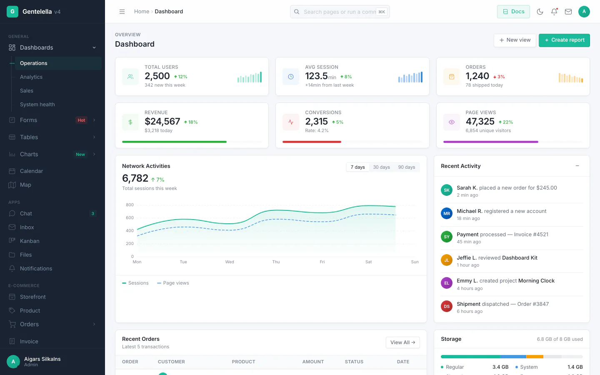
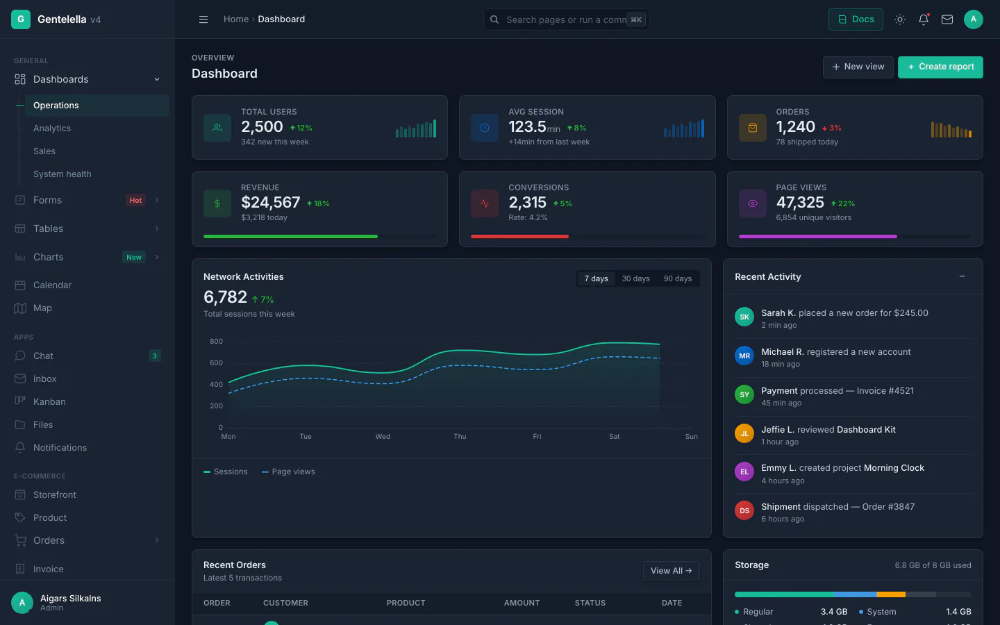
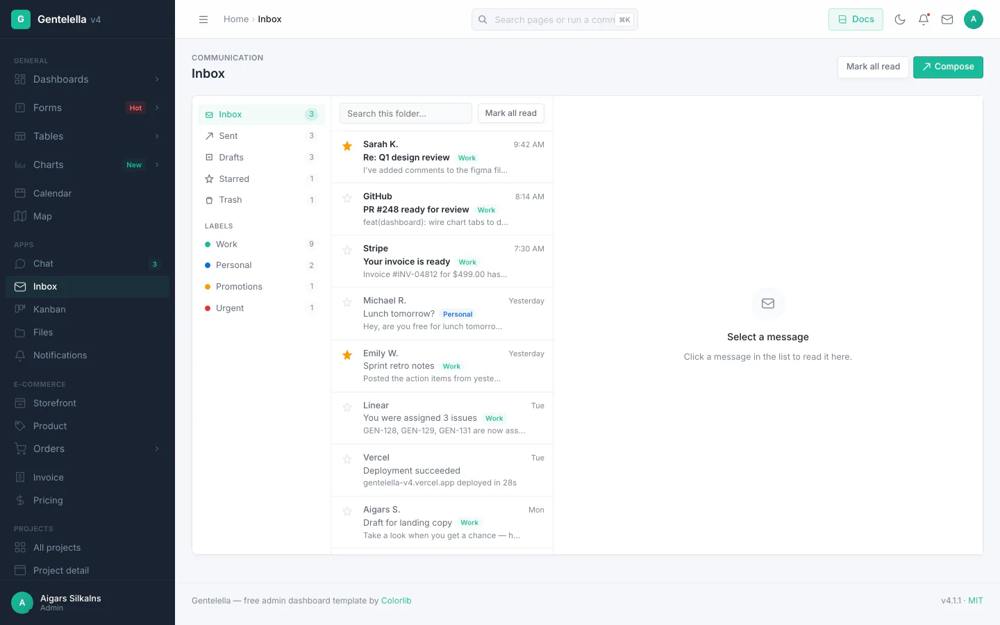
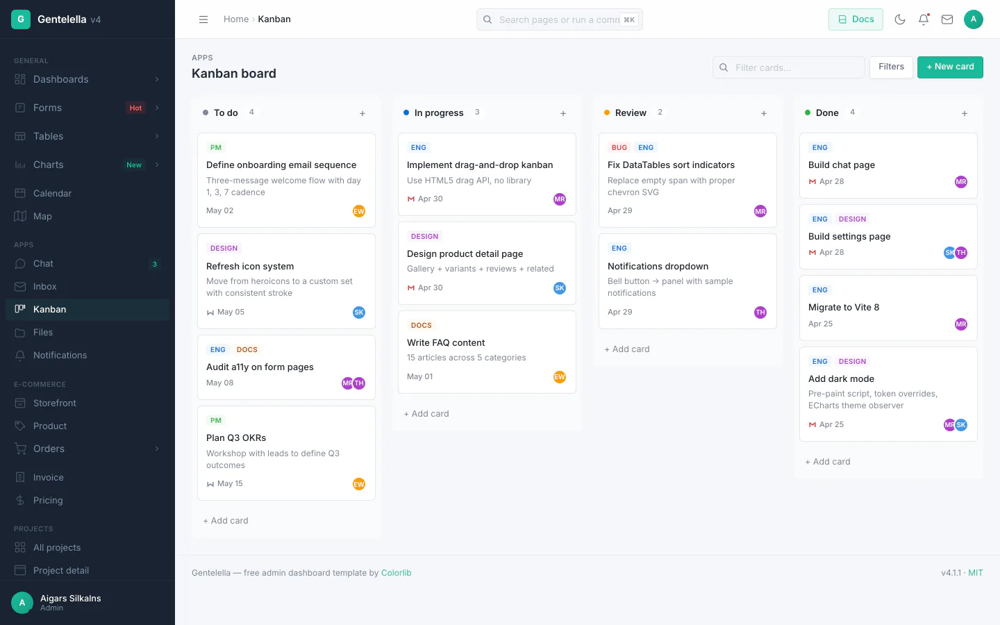
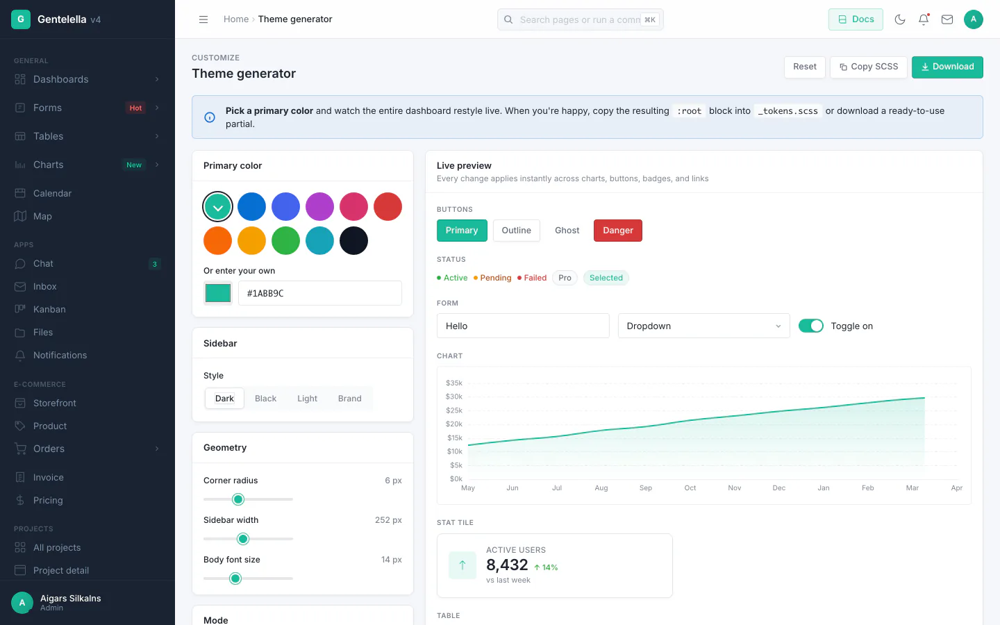

# Dash — Bilingual HR Command Center (KSA)

**English** | [简体中文](README.zh-CN.md)

[](LICENSE.txt)
[](https://vitejs.dev/)
[](#tech-stack)
[](#tech-stack)
[](#key-facts)

**Dash** is an internal, bilingual (English/Arabic) **HR command center** for a Saudi
manpower-supply company: employees, contracts, payroll, compliance, visas, and Ajeer —
built with **vanilla JavaScript**, **SCSS**, and **Vite 8**. **No Bootstrap. No jQuery.
No SPA framework.** Internal tool, not for sale.

**108 pages**: HR dashboard, employee 360° files, contracts, attendance, shifts,
timesheets, leave, payroll + WPS, EOSB, GOSI, compliance, visas, residency, Ajeer
permits, recruitment pipeline, onboarding, reviews, goals, trainings, expenses,
invoices, reports — plus client and employee portals — alongside a full admin shell
(inbox, kanban, calendar, chat, file manager, settings), a **⌘K command palette**,
**dark mode**, and **PWA support**.

<p align="center">
  
  
</p>

<p align="center">
  <em>Inbox · Kanban · Theme generator</em><br>
  
  
  
</p>

> **Regenerate screenshots** — `npm run build && npm run screenshots` boots Playwright
> and captures 22 key pages × light + dark = 44 PNGs to `docs/screenshots/`, plus
> downscaled WebP hero shots for this README (needs `cwebp` — `brew install webp`).

---

## Key facts

- **KSA-first, not a generic HRIS** — Saudi labor law, GOSI, ZATCA, Nitaqat, Qiwa/Mudad,
  Ajeer, and Hijri-aware dates are built into the HR modules.
- **Bilingual everything** — every page, contract, and email renders in English and
  Arabic; RTL layouts use CSS logical properties throughout.
- **Settings-driven** — company profile (name AR/EN, logo, CR no., address), Nitaqat
  category/size/target, and licence scope are all owner-configurable, no code changes.
- **Import + export everywhere** — Excel in both directions on all data grids, plus
  PDF/CSV/print where the data type calls for it.
- **Two portals** — a client portal for client companies and an employee self-service
  portal, alongside the admin command center.
- **Expense management included** — claims, approvals, receipts, VAT handling.

## Get started

**Prerequisites:** Node.js 20+ and npm.

```bash
git clone https://github.com/ar4web/Dash.git
cd Dash
npm install
npm run dev
```

Open the HR dashboard at `http://localhost:9173/production/hr_dashboard.html`
(Vite prints the exact port; `/` redirects there). No database, no API keys, no
environment variables — seed data loads out of the box so every page works offline.

| Command              | What it does                                              |
| -------------------- | --------------------------------------------------------- |
| `npm run dev`        | Dev server with hot reload                                |
| `npm run build`      | Production build → `dist/` (run from the repo root)       |
| `npm run preview`    | Serve the production build locally                        |
| `npm test`           | Static + logic suites (must all pass before every commit) |
| `npm run test:runtime` | Browser-behavior suite (vitest + jsdom)                 |
| `npm run lint`       | ESLint over `src/` (0 errors required)                    |
| `npm run new -- <slug>` | Scaffold a new page from the template                |

Full setup, build, and deploy notes: [docs/getting-started.md](docs/getting-started.md)
and [docs/deployment.md](docs/deployment.md).

## Workflow

Work ships **chunk by chunk**, and every chunk follows the same loop:

1. **Code** a small, reviewable change (one concern per chunk).
2. **Gate it** — `npm test` (static + logic), the runtime suite, ESLint with
   0 errors, Prettier-clean on touched lines, and a dev-server smoke check.
3. **Commit + push** immediately — each chunk lands on the working branch the
   same session; nothing waits for an end-of-day push.

Standing rules: bilingual UI (EN/AR) on everything new, mobile-responsive by
default, KSA compliance for HR logic, no page deletions (improve, don't remove),
and settings-driven behavior over hardcoded values. The full contributor loop —
gates, test suites, commit style, translations — is in
[CONTRIBUTING.md](CONTRIBUTING.md) and [docs/workflow.md](docs/workflow.md).

## Project structure

```text
production/        108 static HTML pages (HR modules + admin shell + portals)
src/v4/            Vanilla ES modules — one per page/feature, lazy-imported
src/scss/v4/       SCSS design system (tokens, layout, components, RTL)
src/main-v4.js     Single entry bundle (shell, theme, i18n, palette)
public/            PWA manifest, service worker, llms.txt, images
docs/              Guides (start at docs/getting-started.md)
tests/             Static audits, HR logic suites, runtime smoke tests
examples/          Optional Express + SQLite backend for the data-adapter pattern
types/             TypeScript declarations for the public JS surface
```

How the entry bundle, shell injection, and lazy imports fit together:
[docs/architecture.md](docs/architecture.md).

## Configuration

The owner sets these in **Settings** (HR → Settings); the app ships with
placeholders, no code changes needed:

- **Company profile** — name (AR/EN), logo, CR number, address, brand color.
- **Nitaqat** — activity category, size, Saudization target.
- **Licence scope** — service vs. labour outsourcing (strict guards by default).

## Tech stack

Vanilla ES2022 + SCSS + Vite 8. Four runtime dependencies, each lazy-imported
per page so pages that don't use them never load them:

- **ECharts 6** — charts · **DataTables.net 3** — data grids ·
  **Leaflet 1.9** — maps · **xlsx** — Excel import/export.

Light + dark mode with `prefers-color-scheme` detection and a pre-paint script
(applied at startup). Installable PWA with offline shell.

## Docs

| Guide                                                    | Covers                                              |
| -------------------------------------------------------- | --------------------------------------------------- |
| [Getting started](docs/getting-started.md)               | Install, dev server, first build                    |
| [Workflow](docs/workflow.md)                             | Chunk loop, gates, releases                         |
| [Architecture](docs/architecture.md)                       | Bundle, shell injection, lazy imports               |
| [Blueprint](docs/architecture-blueprint.md)                | Every page, control, wiring, workflow (diagrams)    |
| [Project structure](docs/project-structure.md)           | What lives in each directory                        |
| [Pages](docs/pages.md)                                   | The bundled pages, adding another                   |
| [HR blueprint](docs/hr-blueprint.md)                     | KSA compliance design record                        |
| [Deployment](docs/deployment.md)                         | Static hosting, subpath deploys, cache headers      |
| [Data adapter](docs/data-adapter.md)                     | Swapping seed data for a real API                   |
| [Theming](docs/theming.md)                               | Tokens, light/dark, custom SCSS                     |
| [Components](docs/components.md)                         | Buttons, cards, badges, reusable markup             |
| [Tables](docs/tables.md) / [Charts](docs/charts.md)      | DataTables skin / ECharts wrapper                   |
| [Forms](docs/forms.md) / [Overlays](docs/overlays.md)    | Inputs & validation / modals, toasts, panels        |
| [RTL](docs/rtl.md) / [PWA](docs/pwa.md)                  | Arabic layouts / service worker, manifest           |
| [Command palette](docs/command-palette.md)               | ⌘K palette, registering commands                    |
| [App modules](docs/app-modules.md)                       | Inbox, kanban, calendar, chat, file manager         |
| [TypeScript](docs/typescript.md) / [FAQ](docs/faq.md)    | Declarations / common questions                     |

## License

MIT — see [LICENSE.txt](LICENSE.txt).
