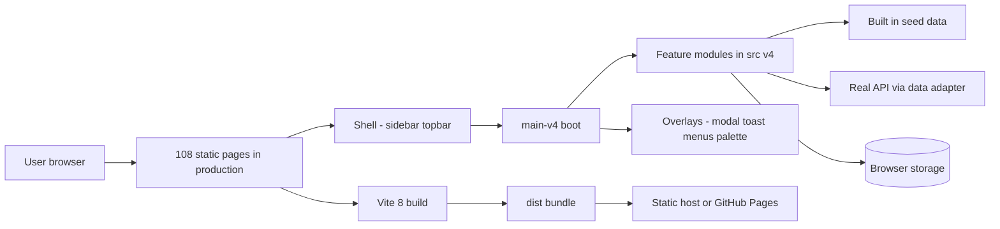
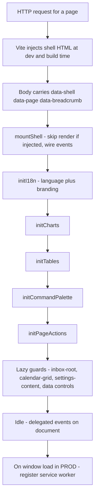
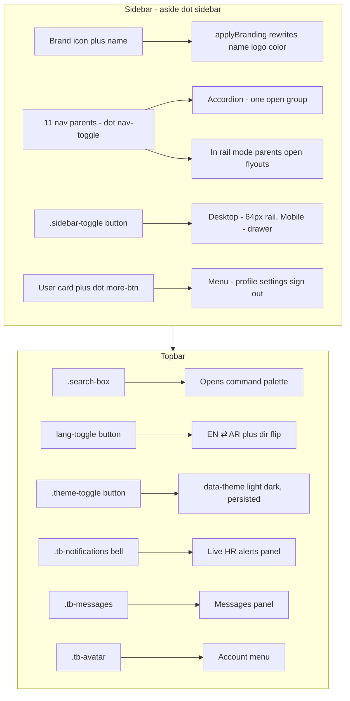
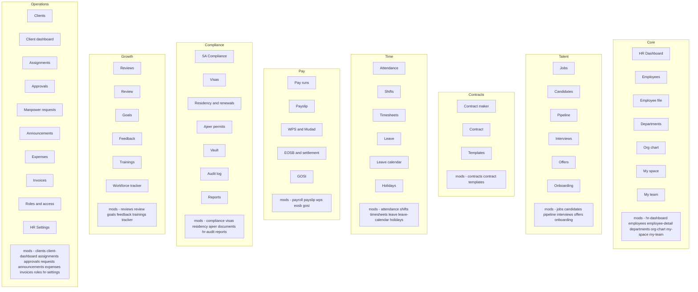
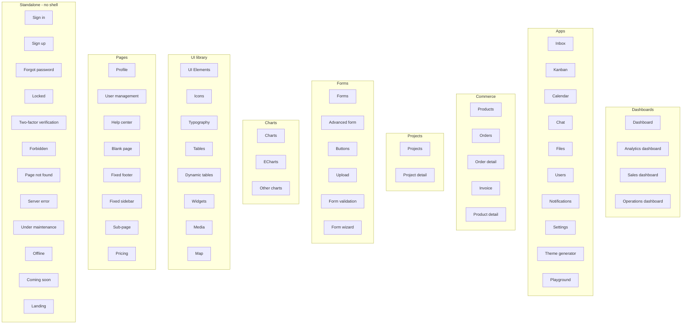
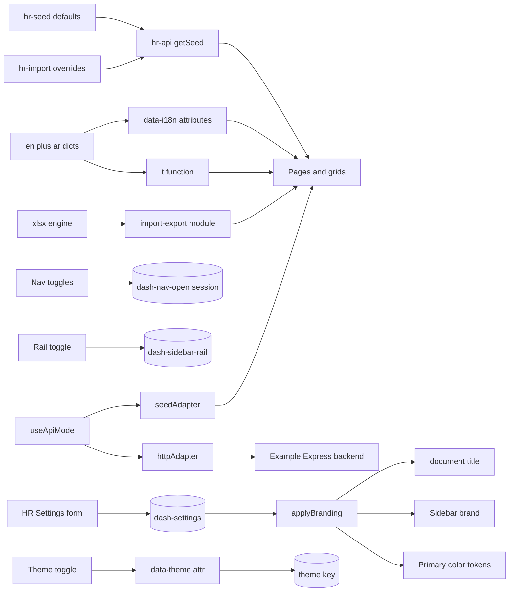
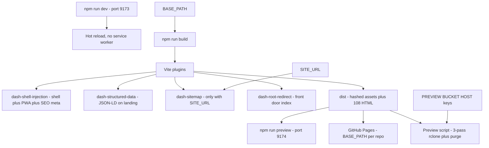
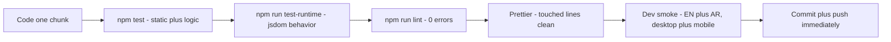

# Architecture Blueprint

Complete map of Dash: every page, every shell control, full wiring, and the
delivery workflow. Diagrams are Mermaid — they render natively on GitHub.

> Scope note: all 108 pages and all shell/global controls are mapped below.
> In-page buttons number in the hundreds, so per-domain key actions are
> listed as tables instead of diagram nodes.

## 1. System at a glance

| Layer | Tech | Notes |
|---|---|---|
| Pages | Static HTML, 108 entries | Auto-discovered by Vite, no input list |
| Entry | `src/main-v4.js`, vanilla ES2022 | One bundle, shell plus lazy guards |
| Style | SCSS partials, CSS custom props | Tokens in `_tokens.scss`, logical props for RTL |
| Charts | ECharts 6 | Lazy chunk `vendor-echarts` |
| Grids | DataTables.net 3 | Lazy chunk `vendor-tables` |
| Maps | Leaflet 1.9 | Lazy chunk `vendor-maps` |
| Excel | xlsx | Lazy import, no split chunk |
| Build | Vite 8, Rolldown, Terser | Hashed assets, shell injection plugins |
| PWA | `sw.js` plus `site.webmanifest` | Worker registers in production only |
| Tests | Node audits, vitest plus jsdom | Static, logic, and runtime suites |

## 2. Boot and runtime lifecycle

Boot order is fixed in `src/main-v4.js`: `mountShell()`, `initI18n()`,
`initCharts()`, `initTables()`, `initCommandPalette()`, `initPageActions()`,
then DOM-presence lazy imports. Common clicks (toggles, tabs, todos) are
delegated on `document`; stateful modules (inbox, kanban, palette) listen on
their own root.

## 3. Shell anatomy and controls

| Control | Selector | Action |
|---|---|---|
| Sidebar toggle | `.sidebar-toggle` | Rail collapse on desktop, drawer plus `.sidebar-backdrop` on mobile |
| Nav parent | `.nav-toggle` × 11 | Accordion expand, persists to `dash:nav-open` |
| Nav subgroup | `.nav-subtoggle` | Expands template sections under HR Settings |
| Search | `.search-box` | Opens ⌘K palette (`openCommandPalette`) |
| Language | `#lang-toggle` | `setLang`, flips `dir`, re-applies i18n plus branding |
| Theme | `.theme-toggle` | Flips `data-theme`, persists `theme`, re-inits charts |
| Bell | `.tb-notifications` | HR alerts popover (compliance, visas, WPS) |
| Messages | `.tb-messages` | Messages popover |
| Avatar | `.tb-avatar` | Account menu |
| User card | `.more-btn` | Sidebar account menu |

Global page actions (`src/v4/page-actions.js`) fire by button text or
`aria-label` when no page handler claims the click: **Print** →
`window.print()` · **Export\*** → CSV/JSON download or `data-export` table
dump · **Compose / New …** → contextual modal · **Refresh** → card pulse
plus chart re-init.

## 4. Page map — HR command center (50 pages)

Key actions by domain (each also carries Import plus Export on its grids):

| Domain | Key actions |
|---|---|
| Core | New employee, 360° file tabs, department tree, org drill-down, team boards |
| Talent | Post job, move pipeline stage, schedule interview, issue offer, onboard checklist |
| Contracts | Generate bilingual contract, e-sign, template variables |
| Time | Check-in/out, plan shifts, submit timesheet, request leave, holiday table |
| Pay | Run payroll, WPS SIF file, EOSB settlement, GOSI computation, print payslip |
| Compliance | Nitaqat gauge, visa issue/renew, residency renew, Ajeer permit, vault upload, audit trail |
| Growth | Start review cycle, set goals, 360 feedback, enroll training, tracker board |
| Operations | Add client, deploy workforce, approve/reject queue, requests inbox, expense claim, invoice issue, role matrix, company profile |

Sidebar NAV is one group (**HR & Operations**) with 11 parents: Overview ·
People · Compliance · Time and Leave · Operations · Employee · Accounts ·
Hiring · Growth · Portals · Settings. Groups render collapsed on desktop and
auto-open the active group on mobile only; a stored toggle always wins.

## 5. Page map — apps and shell (58 pages)

App modules mirror their pages (`inbox.js`, `kanban.js`, `calendar.js`,
`file-manager.js`, `settings.js`, …); chat runs an inline page module.
Standalone pages omit `data-shell="admin"` and render without sidebar or
topbar.

## 6. Data wiring

| Storage key | Store | Purpose |
|---|---|---|
| `theme` | localStorage | Light/dark mode |
| `hr:lang` | localStorage | EN/AR language |
| `dash:sidebar-rail` | localStorage | Collapsed rail state |
| `dash:nav-open` | sessionStorage | Manually toggled group |
| `dash:settings` | localStorage | Company, Nitaqat, licence |
| `dash:theme-overrides` | sessionStorage | Theme lab preview |
| `hr:import:*` | localStorage | Per-grid data overrides |
| `hr:role-view`, `hr:actor-role` | localStorage | Role preview |
| `hr:audit`, `hr:custom-lists` … | localStorage | Audit trail, lists, counters |

Pre-rebrand storage keys migrate forward automatically on load and are
never written fresh (see `migrateStorageKeys` in `src/v4/shell.js`).

## 7. Build and deploy pipeline

Cache contract: hashed `assets/*` immutable for a year · `*.html`,
`llms.txt`, `sitemap.xml` short cache · `sw.js` plus `site.webmanifest`
never cached.

## 8. Delivery workflow and gates

| Suite | Runner | What it pins |
|---|---|---|
| `hr-audit-*` | node | NAV, i18n parity, wiring, links, IDs, style systems, brand leaks, RTL props |
| `hr-logic-*` | node | Payroll, EOSB, leave, compliance rule engines |
| `hr-seed-t2`, `hr-import-test`, `hr-audit-security` | node | Seed integrity, imports, security rules |
| `runtime-smoke.test.js` (127) | vitest | Every page mounts, interactions, shell/header/sidebar contracts |

Full loop, rules, and release process: [workflow](workflow.md).
